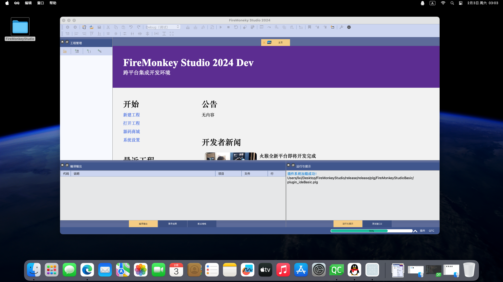
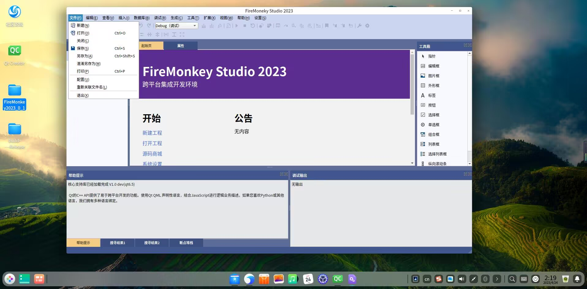

# FireMonkeyStudio

#### 介绍
FireMonkeyStudio2024是一款跨平台可拓展的IDE，支持Windows，Linux，MacOS。外观类似于VisualStudio

#### 开发
本软件使用QT6开发，部分功能使用了部分开源项目tree sitter、QScintilla等...

#### 参与贡献（网络称呼）

1. 开发者：雪花、点点
2. UI设计：狗蛋
3. 其他：斩月

